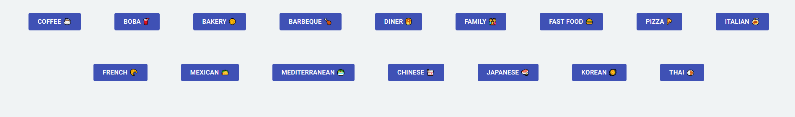
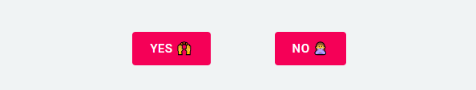
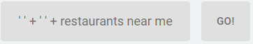
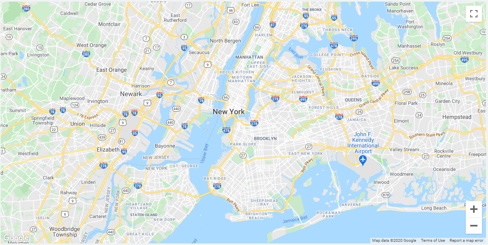

# [!Picky // IN PROGRESS](https://not-picky.herokuapp.com/)


Table of Contents
=================

   * [Description](#description)
   * [Installation & Usage](#installation-and-usage)
   * [Components](#components)
      * [Genre Button](#genre-button)
      * [Take Out Button](#take-out-button)
      * [Go Button](#go-button)
      * [Map](#map)
   * [Dependencies](#dependencies)


# Description

This web app is built using ReactJS, Material UI, Google Geocode API, Google Maps API, and Google Places API. This web app takes in the user's input and current location to search nearby restaurants that match the query request. In order to use the Map component, the user must enable location for the application.

*Request feature is still in progress but the map still loads to the user location

# Installation and Usage

To use !Picky, click the ```genre``` and ```take out``` buttons to indicate your preferred genre and optional take out. Then, scroll down to the ```Go!``` button and click to submit a request. 

The portfolio application requires [Node.js](https://nodejs.org/) to run locally.

First, clone the repository. Then cd into the app, install the dependencies, and start the server.

```
$ cd word-cloud
$ npm install
$ npm start
```

# Components:

### Genre Button



This component component uses ```variant="primary"```, ```Button```, and ```Box``` from the [Material UI dependencies](#dependencies). The dependencies can be imported as ```import { Button, Box } from '@material-ui/core';```. It uses an ```onClick``` function in order to update the current state of the ```genre``` state, which is sent to the [Go!](#go-button) button. An example of the genre buttons and container can be found below:

```
class Buttons extends React.Component {
    constructor(props) {
        super(props);
        this.state = {
            genre: '',
            takeOut: '',
            searchInput: ''
        };
    }
    render() {
        const option = () => {
            this.setState({
                genre: 'put option here'
            })
        }
        
        return (
          <div>
            <Box display="flex" flexDirection="row" flexWrap="wrap" justifyContent="center">
              <Button onClick={coffee} variant="contained" size="large" color="primary" disableElevation style={{ margin: '40px' }}>Example</Button>
              // more buttons here
            </Box>
          </div>
        );
      }
    }
```

### Take Out Button



This component component uses ```variant="secondary"```, ```Button```, and ```Box``` from the [Material UI dependencies](#dependencies). The dependencies can be imported as ```import { Button, Box } from '@material-ui/core';```. It uses an ```onClick``` function in order to update the current state of the ```takeOut``` state, which is sent to the [Go!](#go-button) button. An example of the genre buttons and container can be found below:

```
class Buttons extends React.Component {
    constructor(props) {
        super(props);
        this.state = {
            genre: '',
            takeOut: '',
            searchInput: ''
        };
    }
    render() {
        const option = () => {
            this.setState({
                takeOut: 'put option here'
            })
        }
        
        return (
          <div>
            <Box display="flex" flexDirection="row" flexWrap="wrap" justifyContent="center">
              <Button onClick={coffee} variant="contained" size="large" color="secondary" disableElevation style={{ margin: '40px' }}>Example</Button>
              // more buttons here
            </Box>
          </div>
        );
      }
    }
```

### Go Button



This component component uses ```Button``` and ```Box``` from the [Material UI dependencies](#dependencies). The dependencies can be imported as ```import { Button, Box } from '@material-ui/core';```. This button displays the current ```genre``` and ```takeOut``` states, which is updated by the [genre](#genre-button) and [take out](#take-out-button) buttons. It uses an ```onClick``` function in order to update the current state of the ```searchInput``` state, which is sent to the [Map](#map) component. An example of the go button can be found below:

```
class Buttons extends React.Component {
    constructor(props) {
        super(props);
        this.state = {
            genre: '',
            takeOut: '',
            searchInput: ''
        };
    }
    render() {
            const goButton = () => {
            this.setState({
                searchInput: this.state.genre + ' ' + this.state.takeOut + ' restaurants'
            })
        }
        
        return (
          <div>
            <Box display="flex" flexDirection="row" flexWrap="nowrap" justifyContent="center">
                    <div className="searchInput"><p>' {this.state.genre} ' + ' {this.state.takeOut} ' + restaurants near me</p></div>
                    <Button onClick={goButton} variant="contained" size="large" style={{marginLeft: '16px', color: '#707070'}} disableElevation>Go!</Button>
                </Box>
                
                <MapDisplay searchText={this.state.searchInput}  />
          </div>
        );
      }
    }
```

### Map



This component is a from that accepts the users input and location to produce a map with markers of preferable restaurants in their immediate area. It accepts a ```searchText``` prop from a parent component in order to process a text search request. It uses the [Google Geocode and Google Map React dependencies](#dependencies) in order to generate a map and return nearby restuarants. The map was written according to the [Google Map React examples](https://github.com/google-map-react/google-map-react) with a custom function to change the map position to the user's coordinates:

```
import Geocode from "react-geocode";

Geocode.setApiKey("Key Here");

componentDidMount() {
    navigator.geolocation.getCurrentPosition(position => {
      this.setState({
        mapPosition: {
          lat: position.coords.latitude,
          lng: position.coords.longitude,
        }
      })
    })
  }
```

This Map component is wrapped in a class component in this specific application, which can be imported and used as:

```
import MapDisplay from "./Map";

function App() {
  return (
    <div className="wrapper">
      <MapDisplay searchText="Search input here"  />
    </div>
  );
}

export default App;
```

# Dependencies

Cloudy uses the following dependencies in order to function:

* [ReactJS](https://reactjs.org/) - A JavaScript library for building user interfaces.
* [Google Map React](https://github.com/google-map-react/google-map-react) - Google Maps API, Google Places API, and other maps services for React!
* [React Geocode](https://github.com/shukerullah/react-geocode) - Google Geocode API, this apparently has nothing to do with React!
* [Material UI](https://material-ui.com/) - React UI component library designed according to material design standards.
